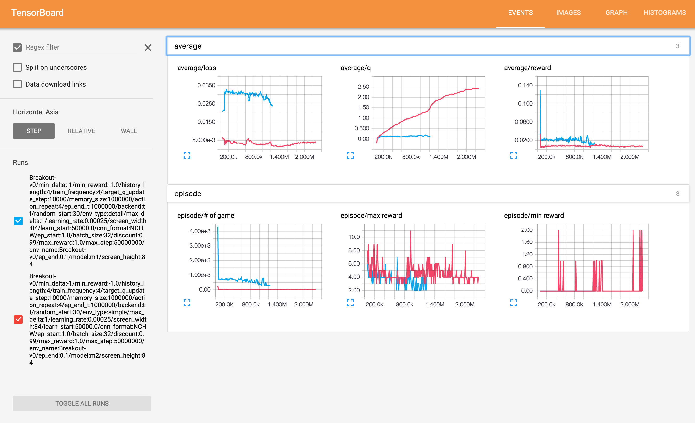

# Human-Level Control through Deep Reinforcement Learning

Tensorflow implementation of [Human-Level Control through Deep Reinforcement Learning](http://home.uchicago.edu/~arij/journalclub/papers/2015_Mnih_et_al.pdf).

This implementation contains:

1. Epsilon-greedy policy and Deep Q-network
2. Experience replay memory
    - to reduce the correlations between consecutive updates
3. Network for Q-learnig targets are fixed for intervals
    - to reduce the correlations between target and predicted Q-values

## Requirements

- Python 2.7 or Python 3.3+
- [gym](https://github.com/openai/gym)
- [tqdm](https://github.com/tqdm/tqdm)
- [OpenCV2](http://opencv.org/)
- [TensorFlow](https://www.tensorflow.org/)

## Usage

First, install prerequisites with:

    $ pip install tqdm gym[all]

To train a model for Breakout:

    $ python main.py --env_name=Breakout-v0 --train=True

To test a trained model for Breakout:

    $ python main.py --env_name=Breakout-v0 --test=True

## Results

(in progress)

## References

- [simple_dqn](https://github.com/tambetm/simple_dqn.git)
- [async_rl](https://github.com/muupan/async-rl)
- [Code for Human-level control through deep reinforcement learning](https://sites.google.com/a/deepmind.com/dqn/)

## License

MIT License.
